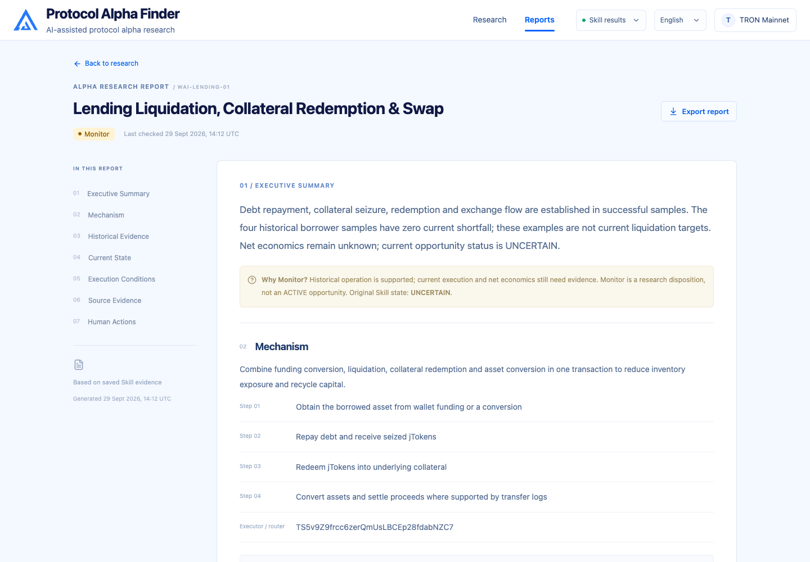

<p align="center">
  
</p>

<h1 align="center">Protocol Alpha Finder</h1>

<p align="center">
  <strong>Alpha finds Wallets. Wallets find more Alpha.</strong><br>
  Discover protocol opportunities through the wallets that executed known mechanisms.
</p>

<p align="center">
  
  
  
  
  
  
</p>

<p align="center">
  <strong>English</strong> · <a href="README.zh-CN.md">简体中文</a> ·
  <a href="#pitch-deck">Pitch Deck</a> ·
  <a href="https://qinyh10300.github.io/protocol-alpha-finder/frontend/index.html">Live Demo</a> ·
  <a href="#system-architecture">Architecture</a> ·
  <a href="#product-experience">Product</a> ·
  <a href="#quick-start">Quick Start</a>
</p>

## Pitch Deck

**[Download the TRON Pitch Deck](pitch-deck/Protocol_Alpha_Finder_TRON_Pitch.pptx)** · [Slide guide and implementation notes](pitch-deck/README.md) · [Bilingual pitch guide](docs/Protocol_Alpha_Finder_Pitch_Guide_v2_Bilingual.md)

The 11-slide deck introduces the research problem, the Alpha–Wallet discovery loop, TRON seeds, Agent reasoning, and the long-term Protocol Alpha Graph. The system diagram below expands that story into the current implementation, including the four Skills, evidence handoffs, local API, and research workspace.

> [!NOTE]
> This is a local research prototype. The screenshots show the saved research run validated on **29 September 2026**. Its five candidates retain the original `UNCERTAIN` opportunity status. The original deck includes planned capabilities; the [pitch notes](pitch-deck/README.md) explain how they relate to the current code.

## What is Protocol Alpha Finder?

Protocol Alpha comes from protocol rules and smart-contract execution: liquidation incentives, keeper actions, or a less obvious sequence of contract calls. A known mechanism gives the research a starting point: identify its actual executors, then investigate what else those wallets have done.

A host Agent uses four reusable Skills to turn wallet history into candidate hypotheses and evidence-based assessments. Each wallet is an independent research job. Each candidate can produce a report, including when the evidence supports continued observation or further investigation.

The product focuses on **Wallet Investigations → Alpha Candidates → Alpha Reports**. Transaction counts communicate evidence volume; reports explain the mechanism, historical observations, current conditions, and remaining checks.

## Product at a glance

- **Three TRON discovery seeds:** Energy Rental liquidation, JustLend lending liquidation, and USDD keeper / auction actions.
- **Independent wallet jobs:** History → Analyze → Search Alpha, with source evidence and coverage attached to each wallet.
- **Open-ended candidate research:** investigate broader wallet activity, including mechanisms outside the original seed.
- **Reports for every outcome:** `ACTIONABLE`, `MONITOR`, `REJECTED`, and `INSUFFICIENT_EVIDENCE`.
- **English by default:** switch to Chinese in the header. The choice persists across pages, reloads, Demo playback, and report exports.
- **Evidence on demand:** wallet and candidate drawers, four-Skill activity, original artifact links, and Markdown report export.

## Product experience

| Stage | What the user sees | Evidence behind it |
| --- | --- | --- |
| Select a seed | Research scope and wallet / candidate / report counts | Per-seed coverage, verified executors, missing inputs |
| Investigate wallets | Each wallet's history, analysis, and discovery progress | Bounded history, transaction counts, source membership |
| Review candidates | Hypotheses with source wallets and reconciled samples | Cross-transaction observations and alternative explanations |
| Read a report | Mechanism, historical evidence, current state, execution conditions | Validation handoffs, ledgers, state reads, evidence gaps |
| Continue research | Save, export, or add a report to a local watchlist | Next checks recorded for the next research pass |



Saved reports and watchlists live in the current browser. Refreshing results reloads saved research files. Automatic watchlist checks and backend Skill execution are planned.

## System architecture


[Architecture details](docs/ARCHITECTURE.md) · [Editable Mermaid source](docs/diagrams/system-architecture-en.mmd) · [Chinese diagram](docs/images/system-architecture-zh-CN.svg)

| Layer | Responsibility | Current implementation |
| --- | --- | --- |
| Evidence | Collect provider responses, receipts, histories, and contract materials | Energy Rental Python collector; host tools or supplied evidence for other seeds |
| Research orchestration | Set scope, coordinate stages, retain gaps and stopping conditions | `protocol-alpha-discovery`, executed by the host Agent |
| Wallet discovery | Verify executors, merge wallet identities, preserve seed provenance | `alpha-seed-wallets` |
| Investigation and validation | Form hypotheses and assess mechanism, history, current state, and execution conditions | `wallet-alpha-investigation` + `protocol-alpha-validation` |
| Saved research | Preserve source references and stage handoffs | Local JSON / Markdown under Git-ignored `data/` |
| Application | Check handoff consistency and expose research views | Python adapter and local HTTP API |
| Experience | Display jobs, candidates, reports, and supporting activity | React 19 + TypeScript + Vite; English / Chinese |

The Agent supplies interpretation and hypotheses. Evidence and deterministic checks support the assessment. The adapter verifies candidate, wallet, transaction, and input-hash consistency before displaying saved validation. General profit accounting and integrated Agent scheduling remain on the roadmap.

### Four Skills, one research workflow

| Skill | Output handed to the next stage |
| --- | --- |
| [`protocol-alpha-discovery`](skills/protocol-alpha-discovery/SKILL.md) | Research scope, stage coordination, final record, stopping reason |
| [`alpha-seed-wallets`](skills/alpha-seed-wallets/SKILL.md) | Deduplicated strategy wallets, per-seed coverage, executor evidence |
| [`wallet-alpha-investigation`](skills/wallet-alpha-investigation/SKILL.md) | Candidate IDs, source transactions, hypotheses, alternative explanations |
| [`protocol-alpha-validation`](skills/protocol-alpha-validation/SKILL.md) | Mechanism assessment, current opportunity status, execution conditions, next checks |

The orchestrator spans the other three Skills. A mechanism supported by evidence may be proposed as a new seed with its limitations preserved. Automated expansion into an Alpha Graph is a future capability.

## Recorded research

The local archive covers **1 July–29 September 2026** and contains:

| Record | Saved result |
| --- | ---: |
| Verified strategy wallets | 10 |
| Energy Rental / JustLend / USDD wallets | 5 / 5 / 0 |
| Unique primary transactions | 52,582 |
| Alpha candidates / reports | 5 / 5 |
| Report outcomes | 3 `MONITOR`, 2 `INSUFFICIENT_EVIDENCE` |
| Original opportunity status | All five `UNCERTAIN` |

A Monitor report preserves a supported historical mechanism for another research pass. It does not establish a currently executable or profitable opportunity. USDD's zero-wallet result applies to bounded provider queries with recorded coverage gaps. Reconciled sample counts are distinct from total execution volume.

The real archive is local and excluded from Git. A new clone can immediately run the synthetic Demo; displaying the recorded research requires restoring its saved artifacts.

## Quick start

**[Try the hosted Demo](https://qinyh10300.github.io/protocol-alpha-finder/frontend/index.html)** to explore the workflow without installing anything. GitHub Pages serves the synthetic replay; saved Skill results use the local application below.

### Requirements

- Node.js 20.19+ or 22.12+
- Python 3.10+
- A modern browser

### 1. Start the workspace

```bash
git clone https://github.com/qinyh10300/protocol-alpha-finder.git
cd protocol-alpha-finder
npm ci
npm run dev
```

Open [the synthetic Demo](http://127.0.0.1:5173/research?mode=demo) and select **Run Discovery**. The replay takes about 17 seconds and supports pause, resume, and replay.

With the local research archive restored, open [Skill results](http://127.0.0.1:5173/research). The app reads the saved handoffs and checks for updates every five seconds. The development command starts Vite on `5173` and the Python API on `5174`.

### 2. Build and serve locally

```bash
npm run build
npm start
```

The production build and API are served together at <http://127.0.0.1:4173/research>.

### 3. Run research with an Agent

Keep all four Skill directories together in an environment that supports `SKILL.md`. Supply chain tools or verifiable transaction / contract materials, then ask:

> Use protocol-alpha-discovery to find strategy wallets through Energy Rental liquidation, JustLend lending liquidation, and USDD keeper / auction actions. Investigate their broader histories and validate candidate mechanisms. Report coverage and missing evidence for each seed.

The default research scope is TRON Mainnet, an initial 90-day window, and up to five evidenced wallets per seed. The repository collector currently supports Energy Rental; the other seeds need host tools or supplied evidence. See [Skill setup](skills/README.md) and [collection setup](docs/energy-rental-collection.md).

### 4. Verify changes

```bash
npm run build
python3 -m unittest discover -s tests -p 'test_*.py'
npm run test:e2e
```

The browser tests use Google Chrome. Tests of the real research require the local archive; they skip explicitly when those files are absent. See [frontend documentation](frontend/README.md) for the API contract and data modes.

## Repository map

| Path | Contents |
| --- | --- |
| [`frontend/`](frontend/) | Research workspace, bilingual UI, report library, Demo data source |
| [`skills/`](skills/) | Four host-executed research Skills and handoff references |
| [`scripts/`](scripts/) | Chain collector, evidence verification, archive adapter, local API |
| [`tests/`](tests/) | Collector, API, browser, and translation checks |
| [`docs/`](docs/) | Architecture, product positioning, collection notes, bilingual pitch guide |
| [`pitch-deck/`](pitch-deck/) | Original 11-slide deck and bilingual slide / status notes |
| [`Protocol_Alpha_Finder_Frontend_Implementation_Pack/`](Protocol_Alpha_Finder_Frontend_Implementation_Pack/) | Product specifications, interaction contract, reference designs, mock data |
| [`demo/`](demo/) | Original synthetic scenario and demonstration script |

## Roadmap

- [x] Connect the workspace to saved outputs from all four Skills.
- [x] Show independent wallet investigations, candidate evidence, and report outcomes.
- [x] Support English and Chinese, report export, and local review actions.
- [x] Preserve collection intervals and explicit coverage limits.
- [ ] Integrate an Agent runner with live progress events.
- [ ] Generalize deterministic cash-flow, cost, and current-state validation.
- [ ] Add explicit monitoring jobs and reviewed seed expansion.
- [ ] Build the Protocol Alpha Graph and record an updated research demo.

README organization takes inspiration from [Soulink-Web](https://github.com/qinyh10300/Soulink-Web). Product screenshots show this repository's local application, captured on 30 September 2026.
