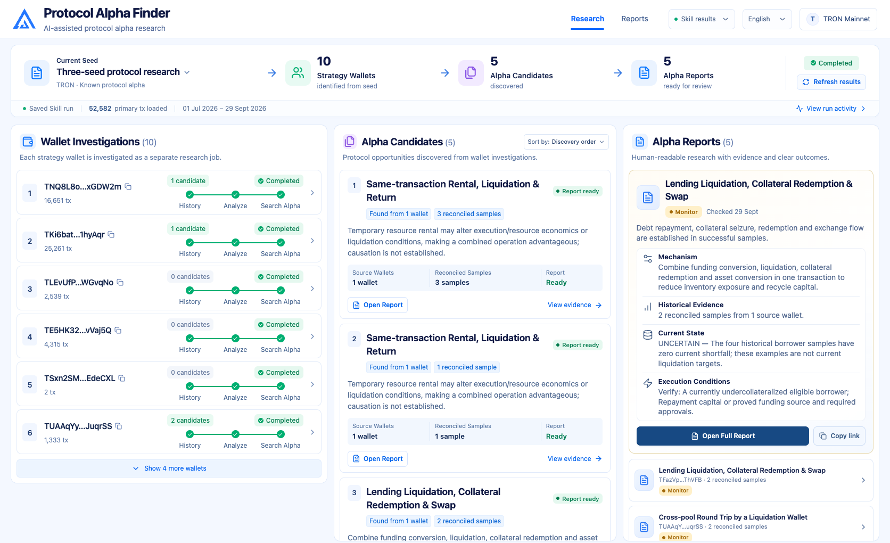
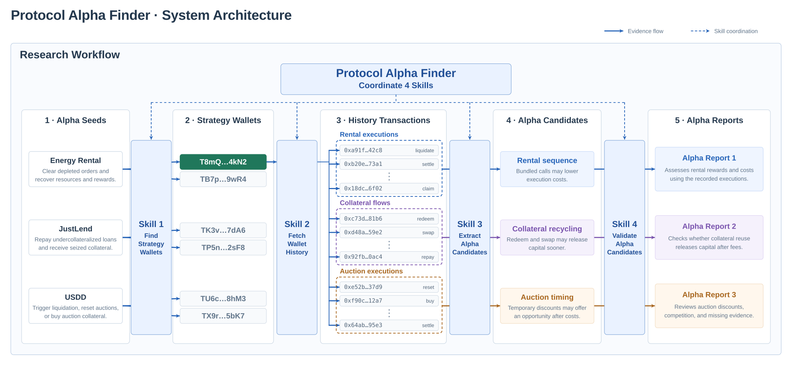

# Protocol Alpha Finder

**English** · [简体中文](README.zh-CN.md)

Find protocol opportunities on TRON by studying wallets that executed known liquidations or keeper actions.

**[Pitch Deck](pitch-deck/Protocol_Alpha_Finder_TRON_Pitch.pptx)** · **[Live Demo](https://qinyh10300.github.io/protocol-alpha-finder/frontend/index.html)** — choose a seed and select **Replay Demo**. Energy Rental and USDD use labeled synthetic examples; JustLend replays saved chain research. [Demo data and refresh instructions](docs/RECORDED_DEMO.md).

## How it works

1. Start from a known mechanism: Energy Rental, JustLend liquidation, or USDD keeper actions.
2. Find its executors and investigate each wallet's broader history.
3. Validate candidates and produce reports with evidence and next checks.

Every candidate gets a report: **Actionable**, **Monitor**, **Rejected**, or **Insufficient Evidence**.



## Recorded results

Research run validated on 29 September 2026: **10 wallets · 52,582 unique primary transactions · 5 reports**.

Outcomes: **3 Monitor, 2 Insufficient Evidence**. All five opportunities remain uncertain; current profitability is unproven.

## System architecture

**Alpha Seeds → Strategy Wallets → History Transactions → Alpha Candidates → Validation.** Protocol Alpha Finder coordinates four steps: find wallets, collect history, extract candidates, and validate evidence.



[Method and Skills](docs/ARCHITECTURE.md) · [Evidence and wallet observation](docs/DATA_ARCHITECTURE.md)

## Run locally

Requires Node.js 20.19+ or 22.12+, and Python 3.10+.

```bash
git clone https://github.com/qinyh10300/protocol-alpha-finder.git
cd protocol-alpha-finder
npm ci
npm run dev
```

Open [the local Demo](http://127.0.0.1:5173/research?mode=demo). JustLend replays a published research snapshot; USDD uses a labeled synthetic fixture and preserves its original zero-result research snapshot separately. The full local Skill-results mode requires the saved `data/` artifacts, which are excluded from Git.

[Skill setup](skills/README.md) · [Development guide](frontend/README.md) · [Pitch notes](pitch-deck/README.md)
