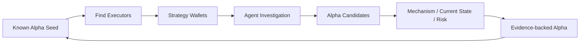

# Protocol Alpha Finder

基于已知 **Protocol Alpha** 的策略发现项目。从协议机制找到实际执行者，再研究这些 **Strategy Wallets** 的历史，提出新的策略假设，并验证机制、当前状态和执行条件。

> **Alpha finds Wallets. Wallets find more Alpha.**

当前版本是研究原型：包含可交互静态前端、4 个 Agent Skills、合成数据 Demo，以及原始 TRON Pitch Deck。链上采集、模型调用与自动验证尚待实现。

## 功能

- **Seed 驱动研究**：围绕 Energy Rental、USDD keeper 与条件式 JustLend Seed 组织研究入口。
- **流程可视化**：切换 Seed，查看 Wallet、Candidate 和 Validation 四个步骤，支持自动播放和手动选择步骤。
- **可复用 Skills**：将研究编排、执行者定位、开放式发现和验证拆分成独立工作流。
- **证据边界明确**：示例候选保持 `UNCERTAIN`，展示仍需收集的证据与执行风险。

## Demo

[前端代码与运行方式](frontend/README.md) · [演示脚本](demo/README.md) · [示例数据](demo/scenarios.json)

```bash
git clone https://github.com/qinyh10300/protocol-alpha-finder.git
cd protocol-alpha-finder
python3 -m http.server 8000 --bind 127.0.0.1
```

打开 <http://localhost:8000/frontend/>。点击「开始流程演示」，或手动切换 Seed 和研究步骤。

**数据说明：** 当前 Demo 使用合成钱包、合成行为序列与合成候选，不连接链上 API、不调用模型，也未证明真实盈利机会。尚未部署在线 Demo，尚无录屏。

## 安装与使用

前端只需要 Python 3 和现代浏览器，无构建步骤或第三方依赖。

Skills 需要支持 `SKILL.md` 的 Agent 环境。四个目录必须一起保留，详见 [Skills 使用说明](skills/README.md)。真实研究还需要用户提供的取证材料，或运行环境已连接的链上读取工具；本仓库尚未提供这些连接器。

在支持技能加载的 Agent 中输入：

> 请使用 protocol-alpha-discovery，基于我提供的 TRON 交易与合约材料，从已知 Seed 定位执行者，研究其历史中的其他策略候选，并列出机制验证、当前状态和执行风险所需证据。

## 系统架构

| 模块 | 职责 | 当前状态 |
| --- | --- | --- |
| `frontend/` | Seed、Wallet、Candidate、Validation 交互工作台 | 合成数据演示 |
| `protocol-alpha-discovery` | 主 Skill：编排研究、记录证据边界和停止条件 | 已编写工作流 |
| `alpha-seed-wallets` | 从 Seed 的成功执行记录定位研究钱包 | 已编写工作流 |
| `wallet-alpha-investigation` | 跨交易分析、形成非标准策略假设 | 已编写工作流 |
| `protocol-alpha-validation` | 核验机制、当前状态与执行条件 | 已编写工作流 |
| `demo/` | 合成数据和可复现演示脚本 | 可本地运行 |
| `pitch-deck/` | 原始演示文稿与材料口径说明 | 已收录 |



Agent 负责语义理解和提出假设；确定性代码负责资金流、成本核算、状态读取与可复现验证。上图是目标架构，当前前端回放示例数据，Skills 由宿主 Agent 执行，不包含后端 Agent Loop。

## Pitch Deck

[下载 TRON Pitch Deck（11 页）](pitch-deck/Protocol_Alpha_Finder_TRON_Pitch.pptx) · [讲稿与口径说明](pitch-deck/README.md)

三个原始文件完整保留：

- [产品定位 v2](docs/Protocol_Alpha_Finder_Product_Positioning_v2.md)
- [中英双语 Pitch Guide v2](docs/Protocol_Alpha_Finder_Pitch_Guide_v2_Bilingual.md)
- [TRON Pitch PPTX](pitch-deck/Protocol_Alpha_Finder_TRON_Pitch.pptx)

v2 文档将 JustLend lending liquidation 定位为条件式 Seed。正式对外演示前，需要核验原 PPT 中的奖励参数和协议现状，详见 [材料差异](pitch-deck/README.md#材料间需要统一的口径)。

## 下一步

- [ ] 接入只读 TRON 数据源，保留交易、区块、时间与原始响应。
- [ ] 用真实 Seed 执行记录替换合成 Demo，验证钱包筛选依据。
- [ ] 实现确定性资金流和成本核算，记录价格来源与时间。
- [ ] 接入 Agent 运行层和前端事件流。
- [ ] 完成至少一个真实候选的机制、当前状态与执行风险报告。
- [ ] 录制真实研究 Demo，并将验证结果更新到 Pitch Deck。

README 的章节组织参考 [novel-scene-to-image-skill](https://github.com/eggry/novel-scene-to-image-skill)，按功能、Demo、安装与使用、系统架构展开。
