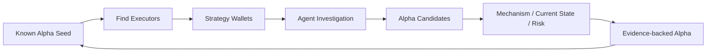

# Protocol Alpha Finder

基于已知 **Protocol Alpha** 的策略发现项目。从协议机制找到实际执行者，再研究这些 **Strategy Wallets** 的历史，提出新的策略假设，并验证机制、当前状态和执行条件。

> **Alpha finds Wallets. Wallets find more Alpha.**

当前版本包含 React + TypeScript 研究前端、4 个 Agent Skills、独立合成 Demo、原始 TRON Pitch Deck，以及 Energy Rental 真实链上采集脚本。前端通过本地 API 读取四个 Skill 的真实运行产物，呈现钱包调查、候选与研究报告；实时 Agent 调度仍需后续接入。

## 功能

- **Seed 驱动研究**：围绕 Energy Rental、USDD keeper 与条件式 JustLend Seed 组织研究入口。
- **研究工作台**：Wallet Investigations → Alpha Candidates → Alpha Reports，支持三个 Seed 筛选、证据抽屉和独立报告页。
- **可复用 Skills**：将研究编排、执行者定位、开放式发现和验证拆分成独立工作流。
- **证据边界明确**：真实留档的 5 条候选保留原始 `UNCERTAIN` 状态，生成 3 份 Monitor 与 2 份 Insufficient Evidence 报告，并列出映射依据和补证条件。

## Demo

[前端代码与运行方式](frontend/README.md) · [演示脚本](demo/README.md) · [示例数据](demo/scenarios.json)

```bash
git clone https://github.com/qinyh10300/protocol-alpha-finder.git
cd protocol-alpha-finder
npm install
npm run dev
```

打开 <http://127.0.0.1:5173/research>。默认读取本地 Skill 结果；右上角切到 Demo mode 后，点击 Run Discovery 可重播合成工作流。

**数据说明：** 本地 `data/` 留档包含 10 个钱包、52,582 笔主交易和 5 条候选。该目录未纳入 Git，新克隆需另行恢复留档或使用 Demo。Refresh results 读取文件更新，不触发新的链上研究。Demo 明确标为合成数据。

## 真实数据采集

已提供 Energy Rental 清算事件发现、真实发起钱包筛选、历史分页抓取与增量检查脚本，详见 [数据采集说明](docs/energy-rental-collection.md)。本地数据保存到 `data/energy-rental/`，已从 Git 跟踪中排除。

```bash
python3 scripts/collect_energy_rental.py update --max-pages 300
python3 scripts/summarize_energy_rental.py
```

以上增量命令要求已经完成首次发现并生成本地 watchlist；首次运行方式见采集说明。

## 安装与使用

前端需要 Node.js 20.19+ / 22.12+、Python 3.10+ 和现代浏览器。构建与 API 说明见 [前端 README](frontend/README.md)。

Skills 需要支持 `SKILL.md` 的 Agent 环境。四个目录必须一起保留，详见 [Skills 使用说明](skills/README.md)。真实研究还需要用户提供的取证材料，或运行环境已连接的链上读取工具；本仓库尚未提供这些连接器。

在支持技能加载的 Agent 中输入：

> 请使用 protocol-alpha-discovery，基于我提供的 TRON 交易与合约材料，从已知 Seed 定位执行者，研究其历史中的其他策略候选，并列出机制验证、当前状态和执行风险所需证据。

## 系统架构

| 模块 | 职责 | 当前状态 |
| --- | --- | --- |
| `frontend/` | 钱包调查、候选验证、报告工作台 | 已接真实 Skill 留档；独立合成 Demo |
| `protocol-alpha-discovery` | 主 Skill：编排研究、记录证据边界和停止条件 | 已编写工作流 |
| `alpha-seed-wallets` | 从 Seed 的成功执行记录定位研究钱包 | 已编写工作流 |
| `wallet-alpha-investigation` | 跨交易分析、形成非标准策略假设 | 已编写工作流 |
| `protocol-alpha-validation` | 核验机制、当前状态与执行条件 | 已编写工作流 |
| `demo/` | 合成数据和可复现演示脚本 | 可本地运行 |
| `scripts/` | 主网清算事件、钱包历史与本地增量检查 | 已接入只读 TronGrid API |
| `pitch-deck/` | 原始演示文稿与材料口径说明 | 已收录 |



Agent 负责语义理解和提出假设；确定性代码负责资金流、成本核算、状态读取与可复现验证。Skills 由宿主 Agent 执行；前端的本地 API 将已保存的交接产物转换为 UI 数据，并轮询文件更新。当前不包含自动执行 Skills 的后端 Agent Loop。

## Pitch Deck

[下载 TRON Pitch Deck（11 页）](pitch-deck/Protocol_Alpha_Finder_TRON_Pitch.pptx) · [讲稿与口径说明](pitch-deck/README.md)

三个原始文件完整保留：

- [产品定位 v2](docs/Protocol_Alpha_Finder_Product_Positioning_v2.md)
- [中英双语 Pitch Guide v2](docs/Protocol_Alpha_Finder_Pitch_Guide_v2_Bilingual.md)
- [TRON Pitch PPTX](pitch-deck/Protocol_Alpha_Finder_TRON_Pitch.pptx)

v2 文档将 JustLend lending liquidation 定位为条件式 Seed。正式对外演示前，需要核验原 PPT 中的奖励参数和协议现状，详见 [材料差异](pitch-deck/README.md#材料间需要统一的口径)。

## 下一步

- [x] 接入只读 TRON 数据源，保留交易、区块、时间与原始响应。
- [x] 展示真实 Seed 执行记录、钱包来源和候选证据，保留独立合成 Demo。
- [ ] 实现确定性资金流和成本核算，记录价格来源与时间。
- [ ] 接入 Agent 运行层和前端事件流。
- [x] 展示 5 条真实候选的机制、当前状态、执行条件及缺口报告；当前可盈利性仍未证实。
- [ ] 录制真实研究 Demo，并将验证结果更新到 Pitch Deck。

README 的章节组织参考 [novel-scene-to-image-skill](https://github.com/eggry/novel-scene-to-image-skill)，按功能、Demo、安装与使用、系统架构展开。
