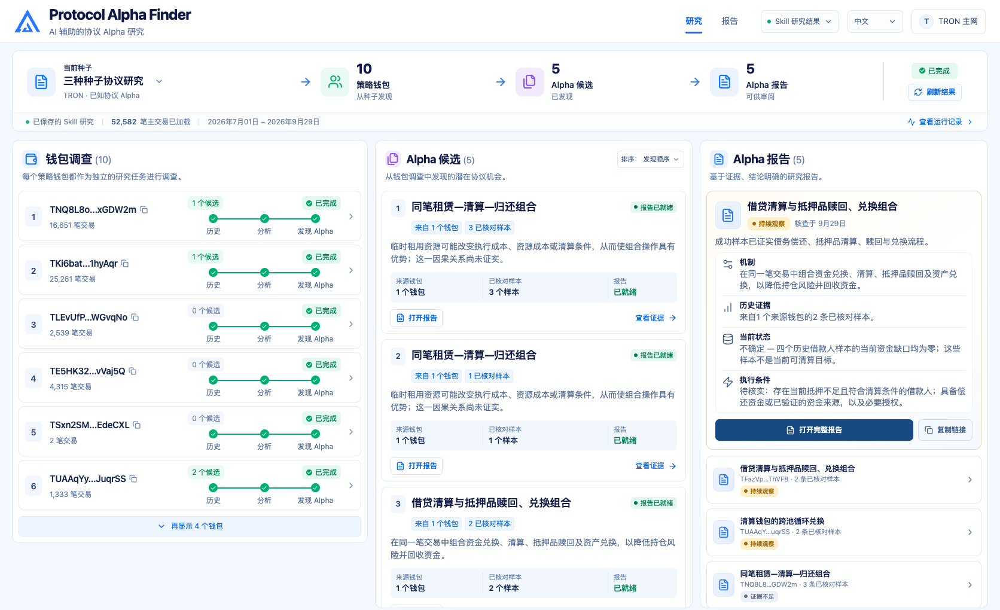

<p align="right">
  🌐 <strong>语言</strong>: <a href="README.md">English</a> · <strong>简体中文</strong>
</p>

<h1 align="center">
  
  Protocol Alpha Finder
</h1>

从执行过清算或 keeper 操作的钱包出发，在 TRON 上寻找协议机会。

**[下载 Pitch Deck — PPTX，11 页](pitch-deck/Protocol_Alpha_Finder_TRON_Pitch.pptx)** · **[在线 Demo](https://qinyh10300.github.io/protocol-alpha-finder/frontend/index.html)**

## 背景

项目始于清算研究中的一个问题：当另一个钱包抢先执行了某个机会，它的历史里还藏着什么？这笔执行记录为我们提供了明确的起点，可以继续研究这个钱包参与过的其他协议活动。

| 概念 | 在本项目中的含义 |
| --- | --- |
| **Alpha Seed（研究种子）** | 用来寻找真实执行者的已知协议机制。初始种子包括 Energy Rental 清算、JustLend 借贷清算和 USDD keeper 操作。 |
| **Strategy Wallet（策略钱包）** | 交易证据表明它执行过相关机制，因此被选为研究对象的钱包。这些证据说明它值得研究，是否盈利仍需验证。 |
| **Alpha Candidate（候选机制）** | 从钱包活动中发现的另一种机制假设，包含支持它的交易，以及尚待验证的问题。 |

我们从已知机制找到钱包，研究它们更广泛的交易历史，再把候选机制整理成有证据支持的报告。得到确认的机制可以成为下一轮研究的新种子。[Pitch Deck](pitch-deck/Protocol_Alpha_Finder_TRON_Pitch.pptx) 描述的长期目标，是建立连接协议机会与执行钱包的关系图。

## 功能

1. **从三个 TRON 种子发现策略钱包。** 从 Energy Rental 清算、JustLend 借贷清算或 USDD keeper 操作出发，验证执行证据，对钱包去重并保留种子来源。

2. **从钱包历史发现新机制。** 按 **History → Analyze → Search Alpha** 调查原始种子之外的合约调用和资产流动，为每个候选保留支持交易与待研究的问题。

3. **验证每个候选。** 检查机制、当前合约状态、奖励、成本与执行条件，记录未解决的问题，区分历史证据与当前可执行性。

4. **查看与分享研究报告。** 在一个工作台中浏览钱包、候选和报告。每份报告给出**可执行（Actionable）**、**持续观察（Monitor）**、**已排除（Rejected）**或**证据不足（Insufficient Evidence）**的结论，并提供证据、后续检查及分享和导出功能。

## Demo

在[在线 Demo](https://qinyh10300.github.io/protocol-alpha-finder/frontend/index.html) 中选择一个种子，再点击 **Replay Research**。三个种子通过同一流程回放已保存的 Skill 研究。每个去重后的候选对应一张报告卡片，可在卡片内切换各钱包的分析。USDD 留档目前没有候选或报告。回放不会查询链上数据。



[Demo 数据与更新说明](docs/RECORDED_DEMO.md)

## 系统架构

**Alpha Seeds → 策略钱包 → 历史交易 → Alpha 候选 → Alpha 报告。** 每个候选都经过验证，并生成自己的报告。

[](docs/images/system-architecture-zh-CN.svg)

报告卡片使用**模拟数字**展示当前机会、单次规模、容量、历史出现次数、历史频率与预测频率。金额以 USDT 计，历史统计窗口为 30 天，预测窗口为未来 7 天。

[方法与 Skills](docs/ARCHITECTURE.zh-CN.md) · [历史证据与钱包观察](docs/DATA_ARCHITECTURE.zh-CN.md)

## Skill 实现

仓库包含 **四个 Skill 包：一个协调 Skill 和三个研究 Skill**。每个 `SKILL.md` 都为宿主 Agent 定义操作流程和交接要求。Python 脚本负责采集与检查证据，Agent 负责解释证据并提出假设。

架构图标注了四个操作步骤。**图中的 Skill 2 和 Skill 3 均由 `wallet-alpha-investigation` 实现**；上方的 `protocol-alpha-discovery` 负责统一协调。

### 协调整个研究流程

[protocol-alpha-discovery](skills/protocol-alpha-discovery/SKILL.md) 接收种子机制、网络、时间窗口和研究限制，依次发现钱包、调查去重后的每个钱包，再把候选证据交给验证流程。最终的[研究记录](skills/protocol-alpha-discovery/references/research-record.md) 保留种子覆盖范围、发现、未知项和后续检查。只有得到确认的机制，才能成为下一轮研究的新种子。

### Skill 1 — 发现策略钱包

[alpha-seed-wallets](skills/alpha-seed-wallets/SKILL.md) 将种子相关调用或事件与成功的交易回执匹配，区分发起钱包、执行合约和奖励接收者，再对钱包去重并保留所有种子来源。[钱包交接记录](skills/alpha-seed-wallets/references/wallet-handoff.md) 包含入选原因、支持交易、角色歧义和获取范围。

仓库自带的 [Energy Rental 采集器](scripts/collect_energy_rental.py) 获取清算事件、验证回执日志并识别交易发起者。JustLend 和 USDD 的钱包发现使用宿主 Agent 的链上工具或用户提供的证据。

### Skill 2–3 — 采集历史并提取候选

[wallet-alpha-investigation](skills/wallet-alpha-investigation/SKILL.md) 接收钱包名单，研究原始种子之外的活动，将合约调用和资产流动整理为重复出现的操作序列。每个候选都保留支持交易、机制解释、替代解释，以及可以推翻假设的检查项。

采集器保存主交易、代币记录和内部记录，并使用 SQLite 检查点支持去重与增量获取。[汇总脚本](scripts/summarize_energy_rental.py) 生成覆盖范围和活动摘要，提示新出现的目标合约；[校验脚本](scripts/verify_energy_rental.py) 检查交易字节哈希。目前的钱包观察依赖人工重复采集与审查。

### Skill 4 — 验证候选并撰写报告

[protocol-alpha-validation](skills/protocol-alpha-validation/SKILL.md) 为每个候选还原资金流、奖励、返还本金和成本，检查当前合约状态、执行条件及替代解释，输出包含证据、假设和后续检查的报告。

报告分别记录机制是否成立，以及当前机会状态：`ACTIVE`、`DEGRADED`、`EXPIRED` 或 `UNCERTAIN`。[研究适配器](scripts/research_adapter.py) 检查已保存的交接引用，并将结果提供给前端；前端单独展示报告结论。工作台读取已保存的结果，不会启动 Skills。

## 安装与使用

### 运行工作台

需要 Node.js 20.19+ 或 22.12+，以及 Python 3.10+。

```bash
git clone https://github.com/qinyh10300/protocol-alpha-finder.git
cd protocol-alpha-finder
npm ci
npm run dev
```

打开[本地 Demo](http://127.0.0.1:5173/research?mode=demo)。**Replay results** 使用仓库自带文件即可运行。本地 **Skill results** 模式需要已保存的 `data/` 留档文件，这些文件未纳入 Git。

### 运行研究流程

将 `skills/` 下的四个目录一起放入宿主 Agent 的 Skill 目录，或让 Agent 直接读取 `skills/protocol-alpha-discovery/SKILL.md`。为它提供链上数据访问能力，或直接提供交易和合约证据。

示例请求：

> 使用 protocol-alpha-discovery，从 TRON 上的 Energy Rental、JustLend 和 USDD 机制发现策略钱包。研究它们的历史，验证每个候选，并报告证据、覆盖缺口和后续检查。

[Skill 配置](skills/README.md) · [开发说明](frontend/README.md) · [Pitch 说明](pitch-deck/README.zh-CN.md)
