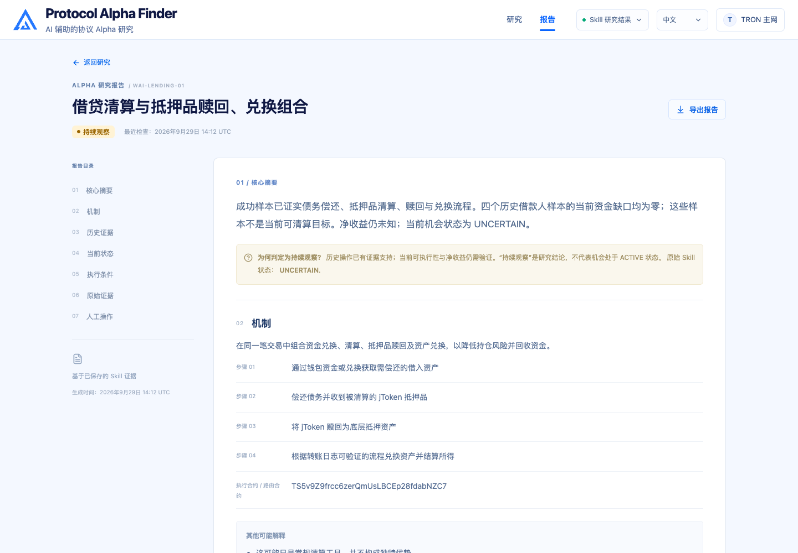

<p align="center">
  
</p>

<h1 align="center">Protocol Alpha Finder</h1>

<p align="center">
  <strong>已知 Alpha 帮助我们找到钱包，钱包再帮助我们发现更多 Alpha。</strong><br>
  从执行过已知机制的钱包出发，发现协议机会。
</p>

<p align="center">
  
  
  
  
  
  
</p>

<p align="center">
  <a href="README.md">English</a> · <strong>简体中文</strong> ·
  <a href="#pitch-deck">Pitch Deck</a> ·
  <a href="https://qinyh10300.github.io/protocol-alpha-finder/frontend/index.html">在线演示</a> ·
  <a href="#系统架构">系统架构</a> ·
  <a href="#产品体验">产品体验</a> ·
  <a href="#快速开始">快速开始</a>
</p>

## Pitch Deck

**[下载 TRON Pitch Deck](pitch-deck/Protocol_Alpha_Finder_TRON_Pitch.pptx)** · [幻灯片目录与实现说明](pitch-deck/README.zh-CN.md) · [中英双语讲稿](docs/Protocol_Alpha_Finder_Pitch_Guide_v2_Bilingual.md)

这份 11 页的 PPT 介绍研究问题、Alpha 与钱包之间的发现循环、TRON 入口、Agent 推理，以及长期的 Protocol Alpha Graph 愿景。下方系统架构图将这条叙事展开为当前实现，覆盖四个 Skill、证据交接、本地 API 和研究工作台。

> [!NOTE]
> 当前项目是本地研究原型。截图展示的是 **2026 年 9 月 29 日**完成验证的留档运行，其中五个候选均保留原始 `UNCERTAIN` 机会状态。原始 PPT 包含计划中的能力，[演示说明](pitch-deck/README.zh-CN.md)列出了它们与当前代码的对应关系。

## 什么是 Protocol Alpha Finder？

Protocol Alpha 来自协议规则与智能合约执行，例如清算激励、keeper 操作，或不明显的合约调用序列。已知机制为研究提供起点：先识别真实执行者，再研究这些钱包还做过什么。

宿主 Agent 使用四个可复用的 Skill，将钱包历史转化为候选假设和有证据支持的判断。每个钱包都是独立研究任务。每个候选都可以生成报告，包括适合继续观察或需要进一步取证的候选。

产品围绕 **钱包研究 → Alpha 候选 → Alpha 报告**展开。交易数量体现证据规模；报告解释机制、历史观察、当前条件和待完成的检查。

## 产品概览

- **三个 TRON 发现入口：** Energy Rental 清算、JustLend 借贷清算、USDD keeper／拍卖操作。
- **独立钱包任务：** 历史加载 → 分析 → 搜索 Alpha，每个钱包都保留来源证据与覆盖情况。
- **开放式候选研究：** 研究钱包更广泛的活动，包括初始入口之外的机制。
- **覆盖所有结果的报告：** `ACTIONABLE`、`MONITOR`、`REJECTED` 和 `INSUFFICIENT_EVIDENCE`。
- **默认英文：** 已保存的语言偏好在页面跳转、重新加载、Demo 播放和报告导出中保持一致。
- **按需查看证据：** 钱包与候选抽屉、四个 Skill 的活动记录、原始产物链接，以及 Markdown 报告导出。

## 产品体验

| 阶段 | 用户看到的内容 | 背后的证据 |
| --- | --- | --- |
| 选择入口 | 研究范围及钱包、候选、报告数量 | 各入口的覆盖情况、已核验执行者、缺失输入 |
| 研究钱包 | 每个钱包的历史加载、分析与发现进度 | 有范围边界的历史、交易数量、入口归属 |
| 审阅候选 | 假设、来源钱包与已核对样本 | 跨交易观察与其他可能解释 |
| 阅读报告 | 机制、历史证据、当前状态、执行条件 | 验证交接文件、账本、状态读取、证据缺口 |
| 继续研究 | 保存、导出或将报告加入本地观察列表 | 为下一轮研究记录的待检查事项 |



保存的报告与观察列表保存在当前浏览器中。刷新结果会重新读取已保存的研究文件。自动检查观察列表和后端执行 Skill 属于计划中的能力。

## 系统架构

四个 Skill 将链上证据转化为 Alpha 报告。宿主 Agent 执行研究，本地 API 将留档结果呈现在工作台中。


[架构详解](docs/ARCHITECTURE.zh-CN.md) · [绘图源码](docs/diagrams/render_architecture.py) · [Mermaid](docs/diagrams/system-architecture-zh-CN.mmd) · [英文架构图](docs/images/system-architecture-en.svg)

## 研究留档

本地留档覆盖 **2026 年 7 月 1 日至 9 月 29 日**，包含：

| 记录 | 已保存结果 |
| --- | ---: |
| 已核验的策略钱包 | 10 |
| Energy Rental／JustLend／USDD 钱包 | 5 / 5 / 0 |
| 去重后的主交易 | 52,582 |
| Alpha 候选／报告 | 5 / 5 |
| 报告结果 | 3 份 `MONITOR`，2 份 `INSUFFICIENT_EVIDENCE` |
| 原始机会状态 | 五个候选均为 `UNCERTAIN` |

Monitor 报告保留有证据支持的历史机制，供下一轮研究使用，不代表当前可执行或可以盈利。USDD 的零钱包结果仅适用于有范围限制的数据查询，相关覆盖缺口已记录。已核对样本数量与总执行次数是不同口径。

真实留档仅保存在本地，未纳入 Git。新克隆的仓库可以立即运行合成 Demo；展示研究留档需要恢复对应产物。

## 快速开始

**[打开在线 Demo](https://qinyh10300.github.io/protocol-alpha-finder/frontend/index.html)**，无需安装即可体验流程。GitHub Pages 提供合成回放；查看 Skill 留档结果请使用下方的本地应用。

### 环境要求

- Node.js 20.19+ 或 22.12+
- Python 3.10+
- 现代浏览器

### 1. 启动工作台

```bash
git clone https://github.com/qinyh10300/protocol-alpha-finder.git
cd protocol-alpha-finder
npm ci
npm run dev
```

打开[合成 Demo](http://127.0.0.1:5173/research?mode=demo)，选择 **Run Discovery**。回放约需 17 秒，支持暂停、继续和重播。

恢复本地研究留档后，打开 [Skill 结果](http://127.0.0.1:5173/research)。应用读取已保存的交接文件，每五秒检查一次更新。开发命令会在 `5173` 端口启动 Vite，在 `5174` 端口启动 Python API。

### 2. 构建并在本地运行

```bash
npm run build
npm start
```

生产构建与 API 共同运行在 <http://127.0.0.1:4173/research>。

### 3. 使用 Agent 进行研究

将四个 Skill 目录一起放入支持 `SKILL.md` 的环境。提供链上工具或可核验的交易／合约材料，然后发起请求：

> 使用 protocol-alpha-discovery，从 Energy Rental 清算、JustLend 借贷清算、USDD keeper／拍卖操作三个入口寻找策略钱包。研究它们更广泛的历史并验证候选机制。分别报告每个入口的覆盖情况与缺失证据。

默认研究范围是 TRON 主网、初始 90 天窗口，每个入口最多选五个有证据的钱包。仓库采集器当前支持 Energy Rental；其他入口需要宿主工具或提供的证据。详见 [Skill 配置](skills/README.md)与[采集配置](docs/energy-rental-collection.md)。

### 4. 验证修改

```bash
npm run build
python3 -m unittest discover -s tests -p 'test_*.py'
npm run test:e2e
```

浏览器测试使用 Google Chrome。真实研究数据测试需要本地留档；文件缺失时会明确跳过。API 契约与数据模式详见[前端文档](frontend/README.md)。

## 仓库目录

| 路径 | 内容 |
| --- | --- |
| [`frontend/`](frontend/) | 研究工作台、双语界面、报告库、Demo 数据源 |
| [`skills/`](skills/) | 由宿主执行的四个研究 Skill 及交接参考 |
| [`scripts/`](scripts/) | 链上采集器、证据核验、留档适配器、本地 API |
| [`tests/`](tests/) | 采集器、API、浏览器与翻译检查 |
| [`docs/`](docs/) | 架构、产品定位、采集说明、双语讲稿 |
| [`pitch-deck/`](pitch-deck/) | 原始 11 页 PPT 与双语幻灯片／实现状态说明 |
| [`Protocol_Alpha_Finder_Frontend_Implementation_Pack/`](Protocol_Alpha_Finder_Frontend_Implementation_Pack/) | 产品规格、交互契约、参考设计、模拟数据 |
| [`demo/`](demo/) | 原始合成场景与演示脚本 |

## 路线图

- [x] 将工作台接入四个 Skill 的留档产物。
- [x] 展示独立钱包研究、候选证据与报告结果。
- [x] 支持中英文、报告导出与本地审阅操作。
- [x] 保留采集区间与明确的覆盖限制。
- [ ] 集成 Agent 执行器和实时进度事件。
- [ ] 扩展确定性资金流、成本与当前状态验证。
- [ ] 增加明确的监控任务与经过审阅的入口扩展。
- [ ] 构建 Protocol Alpha Graph 并录制更新后的研究演示。

README 组织形式参考 [Soulink-Web](https://github.com/qinyh10300/Soulink-Web)。产品截图来自本仓库的本地应用，拍摄于 2026 年 9 月 30 日。
