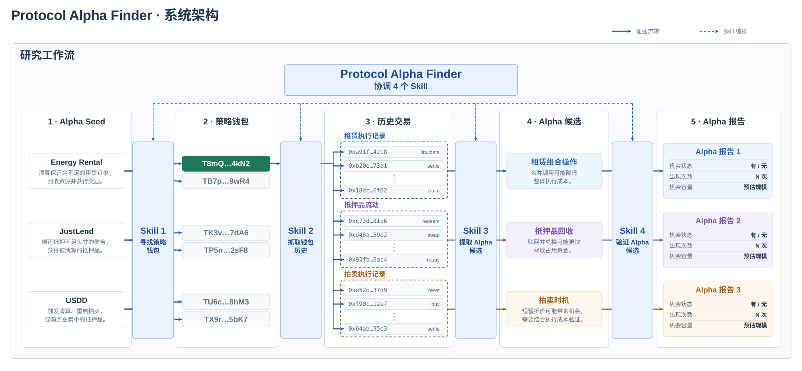

# Strategy Wallet 发现与验证方法

[English](ARCHITECTURE.md) · **简体中文** · [项目首页](../README.zh-CN.md)

**已知 Alpha → 策略钱包 → 新 Alpha。** 从已知协议机制出发，找到真正执行过它的钱包，再通过这些钱包更广泛的活动发现并验证新候选。



## 如何阅读流程图

大框内包含四个阶段：**01 Alpha Seeds → 02 策略钱包 → 03 Alpha 候选 → 04 Validation 验证**。每个 Seed 连接两个缩写的虚拟 TRON 地址；其中一个钱包用绿色高亮，分别连向三个候选机制，说明同一个钱包可以在原始 Seed 之外揭示其他机会。

Skill 1–3 的标记放在阶段间的箭头上，用简短词组说明工作内容，上方的 **Skill 4 通过虚线统一编排这三个 Skill**。图的下半部分呈现历史证据与钱包新增活动的复查，最下方的技术架构框图连接 TRON 数据、采集与研究、研究归档和研究工作区。

| 候选示例 | 为什么值得研究？ |
| --- | --- |
| 租赁组合操作 | 合并调用可能降低执行成本 |
| 抵押品回收 | 赎回并兑换可能更快释放占用资金 |
| 拍卖时机 | 短暂折价值得结合执行成本检查 |

六个钱包用于展示方法，不代表实际留档数量。USDD 钱包与拍卖假设属于示意。本次留档中，USDD 没有已核验钱包；五份报告为三份持续观察、两份证据不足，尚无候选被提升为新 Seed。真实证据保存在 `validation-handoff.json` 与 `validation-results.json` 中。

## 四个 Skill

### Skill 1. 发现并核验钱包 — `alpha-seed-wallets`

从 Energy Rental 清算、JustLend 清算或 USDD keeper／拍卖操作出发。匹配调用与成功回执，识别真实执行者，并区分中继者、辅助合约与奖励接收方。

**输出：** 去重后的策略钱包候选，附执行证据与入口来源。筛选依据是已发生的协议活动；执行过一次操作不代表已证明优势或盈利。

### Skill 2. 发现候选 — `wallet-alpha-investigation`

逐个研究钱包更广泛的历史，包括原始入口之外的活动。从重复调用序列与资产流动中形成机制假设，保留支持交易与其他可能解释。

**输出：** Alpha 候选，附证据、覆盖限制与能够推翻假设的检查项。

### Skill 3. 验证候选 — `protocol-alpha-validation`

还原机制与资产流，核算已知成本，检查协议当前状态并评估执行条件。区分历史观察与当前可用性，缺失的输入保留为未知。

**输出：** Alpha 报告，包含机制判断、当前状态、执行要求和后续检查。审阅结果分为可执行、持续观察、已排除和证据不足。

### Skill 4. 编排研究 — `protocol-alpha-discovery`

确定链、时间窗口与研究边界。协调钱包发现、研究和验证，保留证据与未解决的问题。覆盖既定范围或缺少必要证据时停止。

## 何时进入下一轮

只有机制得到验证，才可在研究范围内作为新的 Seed Alpha，并保留当前限制。仅有合理假设不足以进入下一轮。本次留档尚未将候选提升为新入口。

## 源文件

[编排 Skill](../skills/protocol-alpha-discovery/SKILL.md) · [钱包发现 Skill](../skills/alpha-seed-wallets/SKILL.md) · [钱包研究 Skill](../skills/wallet-alpha-investigation/SKILL.md) · [候选验证 Skill](../skills/protocol-alpha-validation/SKILL.md)

中英文 SVG 和 [Mermaid 图](diagrams/system-architecture-zh-CN.mmd) 均由 [render_architecture.py](diagrams/render_architecture.py) 生成：

```bash
python3 docs/diagrams/render_architecture.py
```

## 研究数据

[数据研究与观察流程](DATA_ARCHITECTURE.zh-CN.md)说明我们分析哪些历史证据，以及如何从钱包的新活动中发现新候选。
