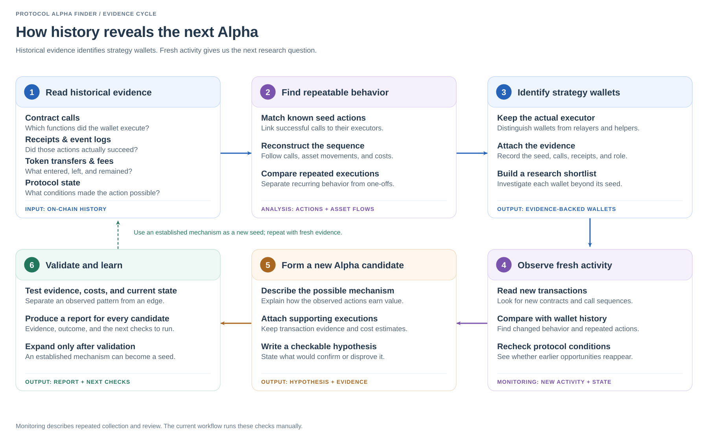

# From historical evidence to new Alpha

**English** · [简体中文](DATA_ARCHITECTURE.zh-CN.md) · [Research pipeline](ARCHITECTURE.md)

We study successful protocol actions to identify their executors, then review those wallets' broader history and new activity for other mechanisms.

## What we study

| Evidence | Research question |
| --- | --- |
| Contract calls | Which functions and contracts did the wallet use, and in what order? |
| Receipts and event logs | Did the action succeed, and who actually executed it? |
| Token transfers and fees | What assets moved, what remained, and what did execution cost? |
| Protocol state | Which conditions enabled the action, and are those conditions available now? |

## How the research continues

1. Match known seed actions to successful calls and actual executors.
2. Reconstruct repeated call sequences and asset flows to shortlist strategy wallets.
3. Investigate each wallet beyond its original seed, retaining transaction evidence.
4. Review fresh transactions for new contracts, changed behavior, and returning conditions.
5. Form candidate mechanisms with supporting executions and checks that could disprove them.
6. Validate evidence, costs, and current availability; produce a report for every candidate.

An established mechanism can become a new seed. Unresolved candidates retain their missing evidence and next checks. Monitoring here means repeating collection and review; the current workflow runs these checks manually.

[Wallet discovery](../skills/alpha-seed-wallets/SKILL.md) · [Wallet investigation](../skills/wallet-alpha-investigation/SKILL.md) · [Candidate validation](../skills/protocol-alpha-validation/SKILL.md)

To regenerate the bilingual figures: `python3 docs/diagrams/render_data_architecture.py`.
