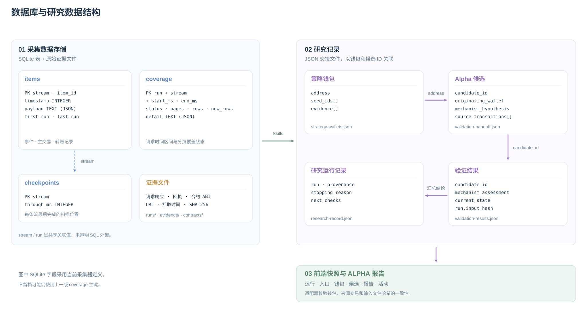

# 数据库与研究数据

[English](DATA_ARCHITECTURE.md) · **简体中文** · [研究流程](ARCHITECTURE.zh-CN.md)

链上采集证据保存在 SQLite 和文件中。Skills 将研究结论保存为 JSON 交接文件，适配器据此生成研究工作区和 Alpha 报告。



## 采集数据存储

各采集目录可包含一个 `research.sqlite3` 数据库，使用三张表：

| 表 | 主键 | 保存内容 |
| --- | --- | --- |
| `items` | `stream, item_id` | 时间戳、JSON 原始记录、首次与最近采集运行 |
| `coverage` | `run, stream, start_ms, end_ms` | 分页状态、页数、记录数、新增数、JSON 详情 |
| `checkpoints` | `stream` | 最近完成扫描的时间边界 `through_ms` |

`items` 另有 `(stream, timestamp)` 索引。记录通过相同的 stream 和 run 值关联，数据库未声明外键。检查点仅在扫描完整结束后推进。图中采用当前采集器定义；旧留档可能仍使用 `(run, stream)` 作为 coverage 主键。

原始响应位于 `runs/<run>/*.json.gz`，保留请求信息、时间戳与哈希。回执和合约信息分别保存在 `evidence/` 与 `contracts/` 中。

## 研究记录

以下记录以 JSON 文件保存，由适配器检查关联关系：

| 记录 | 文件 | 关联依据 |
| --- | --- | --- |
| 策略钱包 | `strategy-wallets.json` | `address`、Seed ID、执行证据 |
| Alpha 候选 | `validation-handoff.json` | `candidate_id`、`originating_wallet`、来源交易 |
| 验证结果 | `validation-results.json` | 候选 ID、机制判断、当前状态 |
| 研究运行 | `research-record.json` | 来源、研究发现、停止原因、后续检查 |

适配器读取这些文件，并检查候选 ID、钱包地址、来源交易集合，以及文件中提供的交接哈希。随后生成包含入口、钱包、候选、报告和活动的前端快照。报告可以记录尚不确定的结论或缺失证据。

## 来源与重新生成

[采集器表结构](../scripts/collect_energy_rental.py) · [研究适配器](../scripts/research_adapter.py) · [前端数据类型](../frontend/src/types.ts)

```bash
python3 docs/diagrams/render_data_architecture.py
```

脚本仅依赖 Python 标准库，生成英文、中文 SVG 和 Mermaid 源文件。
